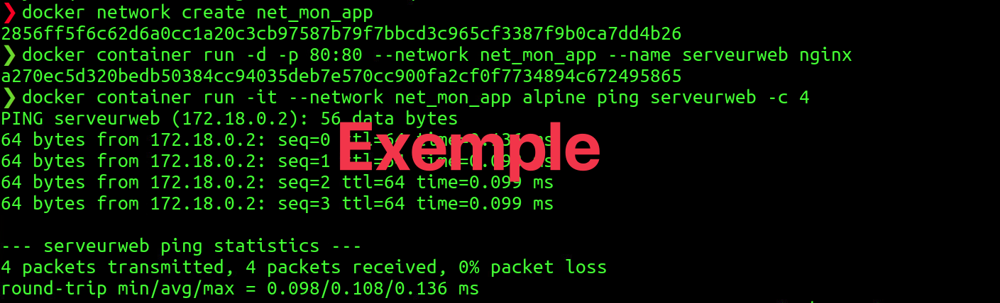

#  Exercice 11 :  DNS 

### Informations
- Évaluation : formative.
- Durée estimée : 2 heures.
- Système d'exploitation : Ubuntu client ou Windows.
- Environnement : Docker.  

### Objectifs  

- Comprendre le DNS.
- Comprendre le principe de DNS à l’intérieur dans Docker.

Dans cet exercice, vous allez constater à quel point il peut être fastidieux de trouver une résolution d’adresse sans un serveur récursif. Heureusement nous disposons d'un bon serveur DNS récursif, qui fait tout ce travail à notre place.

Un DNS récursif garde en mémoire ce qu'il trouve en effectuant cette recherche et s'en resservira pour d'éventuelles résolutions futures. Les serveurs « qui font autorité » (serveur du FQDN) indiquent une durée de validité pour les informations qu'ils donnent. Ainsi, les serveurs récursifs devront rafraichir le contenu de leur cache en fonction de dette durée de validité.

Vous allez également comprendre comment les conteneurs se « trouvent » dans Docker et comprendre que le DNS est la clé pour faciliter les communications entre conteneurs. Vous allez aussi découvrir comment ça fonctionne par défaut avec les réseaux personnalisés.

Vous avez vu que les conteneurs se retrouvent dans un réseau virtuel privé dans Docker et chacun des conteneurs se voient attribuer une adresse IP. Par contre, les conteneurs ne doivent pas compter sur les adresses IP pour l'intercommunication, car ces adresses peuvent changer. Docker possède un DNS intégré qui utilise les noms des conteneurs (il est également possible de créer des alias) comme enregistrement. Il est donc possible d’utiliser ce DNS dans vos réseaux personnalisés (le réseau « bridge » n’a pas de DNS).

## Section 1 : DNS et récursivité

### Étape 1 : sous Windows

Utilisez un poste Windows, soit votre propre ordinateur ou une VM, et répondez aux questions.

- Qu'elle est le serveur de nom (DNS) pour votre poste client ?
	

	
Réponse

	Varie.
	</detail>

- Quelle commande avez-vous utilisée ? 
	

	
Réponse

	`nslookup`
	</detail>

- Faites un nslookup sur le nom de domaine : csfoy.ca

	Qui vous a répondu ? Est-ce que la réponse fait autorité ?
	

	
Réponse

	Votre serveur DNS.
	Si vous êtes à l'intérieur du cégep, oui. Sinon, non.
	</detail>

- Faites un nslookup sur le nom de domaine : gouv.qc.ca

	Qui vous a répondu ? Est-ce que la réponse fait autorité ? 
	

	
Réponse

	Votre serveur DNS.
	Non, elle n'est pas autoritée.
	</detail>

- Essayer à nouveau avec un nslookup sur le nom de domaine : www.google.com

	Qui vous as répondu ? Est-ce que la réponse fait autorité ?
	

	
Réponse

	Votre serveur DNS.
	Non, elle n'est pas autoritée.
	</detail>

- À partir des expériences précédentes, a quel moment la réponse fait autorité ? 
	

	
Réponse

	La réponse fait autorité lorsque le serveur DNS qui nous répond est celui du FQDN.
	</detail>

### Étape 2 : sous Linux

- Utilisez les commandes `nmcli` pour trouver les informations suivantes : 

Nom de l’interface de sortie
Adresse IP
Masque 
Passerelle
DNS configuration 
Servers
Domains
Interfaces

2.	Faites la commande : cat /etc/hostname à quoi sert ce fichier ? 

3.	Faites la commande : cat /etc/hosts à quoi sert ce fichier ?

4.	Faite la commande nslookup et puis taper localhost et enter.
Qu'elle est le serveur de nom (DNS) pour votre serveur ?

5.	Faites un nslookup sur  le nom de domaine : csfoy.ca (attention, les réponses peuvent varier si vous avez utilisé une VM sur  VM Ware Workstation ou au autre hyperviseur.)

Qui vous a répondu ? Est-ce que la réponse fait autorité ? 

6.	Faites un nslookup sur le nom de domaine : gouv.qc.ca
Qui vous as répondu ? Est-ce que la réponse fait autorité ? 

7.	Comparer votre réponse avec celle obtenue aux points précédents.

8.	Quitter le nslookup (commande exit) et faites maintenant la commande 
host csfoy.ca

Est-ce que les réponses sont les mêmes qu'avec la commande nslookup ?

9.	Ajouter maintenant l'option -v (host -v csfoy.ca) quel est la différence ?

10.	Faites maintenant la commande host -v www.csfoy.ca. Que remarquez-vous de différent ? De quel type d'enregistrement est-il question ? Elle pointe vers où ?

11.	Nous allons utiliser notre outil host pour chercher à résoudre le FQDN www.csfoy.ca non plus en posant la question à notre serveur DNS récursif, mais en partant de la source, à savoir un root-server : 192.58.128.30, en utilisant la commande comme ceci :

	host -v www.csfoy.ca 192.58.128.30|less

12.	Le serveur j-root-servers.net ne répond pas directement, comme nous pouvions nous en douter. En revanche, il nous envoie la liste des serveurs DNS compétents dans le TLD ca. Reposons donc la question au premier de la liste :

host -v www.csfoy.ca 185.159.196.2 

(ATTENTION : Utilisez l'adresse de votre écran et non celles données ici.)

13.	Qui fait autorité pour le domaine du Cégep ?

14.	Essayer de refaire le cheminent à partir d'un serveur root de votre choix 
(voir le liste à http://www.root-servers.org/ ) avec un domaine possédant un Top Level Domain différent.

Et voilà le travail. Nous pouvons constater à quel point il peut être fastidieux de trouver une résolution d’adresse sans un serveur récursif. Heureusement nous allons disposer d'un bon serveur DNS récursif, qui fait tout ce travail à notre place. Car c'est exactement de cette manière qu'il s'y prend pour nous obtenir la réponse.

Un DNS récursif garde en mémoire qu'il trouve en effectuant cette recherche et s'en resservira pour d'éventuelles résolutions futures. Les serveurs « qui font autorité » indiquent une durée de validité pour les informations qu'ils donnent. Ainsi, les serveurs récursifs devront rafraichir le contenu de leur cache en fonction de dette durée de validité. 

## Pour vérification

Remettre une capture d’écran de ??? dans l'espace travaux, sur LÉA.

