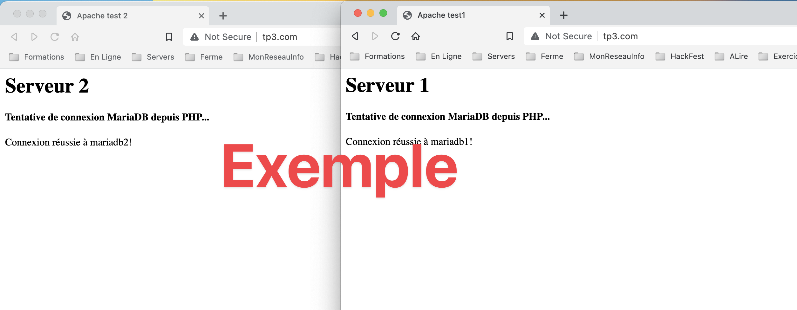

# Travail pratique 3 - Travail sur serveur Web

### Informations

- Évaluation : 20 % de la session
- Type de travail : individuel
- Date de remise : Voir sur LÉA
- Durée : 4 heures
- Système d’exploitation : Linux ou Windows
- Environnement : Docker

### Objectifs

- Déterminer un plan d’installation des serveurs.
- Configurer les paramètres réseau du serveur.
- Vérifier et valider la connectivité des serveurs au réseau.
- Vérifier les impacts de la connexion des nouveaux serveurs sur le fonctionnement des systèmes existants.
- Configurer les périphériques / composantes pour une connectivité au réseau.
- Appliquer les procédures d’Installation des services intranet conformément aux procédures et spécifications techniques.
- Appliquer un plan des étapes d’installation des services en tenant compte des liens (dépendances) entre les services et des besoins exprimés.  
- Configurer les services intranet selon la documentation ou le plan de conception (p. ex. : architecture réseau, technologie, etc.).  
- Configurer les services et les applications selon la nature du serveur.  
- Tester le fonctionnement des services intranet.
- Comprendre l’interdépendance des services pour les activer dans l’ordre.
- Activer les services intranet selon les procédures recommandées.  
- Configurer les services Internet selon la documentation ou le plan de conception (Ex. : architecture réseau, technologique, etc.).  
- Tester le fonctionnement des services Internet.  
- Activer les services Internet selon les procédures recommandées. 

### But

Ce travail pratique a pour objectifs :

- Faire une installation complète d’un site Web avec équilibrage de charge.
- Utiliser nginx comme un équilibreur/répartiteur de charge (load balancer).
- Utiliser Apache (httpd) comme serveur de contenus.

Dans ce travail, vous allez créer un site Web complet comprenant nginx comme équilibreur de charge et deux serveurs httpd complets (incluant php et MariaDB) comme serveur de contenus.

## Vous devez fournir - remise

Vous devez déposer votre travail sur Git Hub. Celui-ci doit comprendre les éléments suivants : 

- Un dépôt Git.
	- **Vous devez indiquer l'adresse du dépôt dans LÉA, Travaux -> TP3 – Travail sur serveur Web.**  
- Fichier <code>docker-compose</code>.
- Fichier(s) <code>Dockerfile</code>.
- Fichiers html/css/php du site Web.
- Un fichier README.md contenant :
	- Une description du projet.
	- Une explication du fonctionnement : lien entre nginx et les serveurs Web, lien entre un serveur Web et les serveurs php et MariaDB.
	- Une liste de commandes, avec explications, pour lancer le projet, vérifier (exécution, logs, ports ouverts) son fonctionnement, arrêter et nettoyer le projet.
	- Au moins une image démontrant le fonctionnement du site Web.
- Je dois avoir le droit de contributeur sur le dépôt Git.
- Je dois pouvoir reproduire votre TP3 sur mon poste et vérifier son fonctionnement. Donc, je dois pouvoir faire :

```bash
git clone git@github.com:votre_compte/TP3_VotreNom.git
cd TP3_VotreNom
docker compose up
```
Exemple d'image du fonctionnement.  
 

## Description

- Nginx est utilisé comme équilibreur de charge pour avoir une structure comme celle-ci :  

```
                           |-- serveur1 (httpd)|
                           |                   |--php1
www.tp3.com── proxy (nginx)|                   |--mariadb1
                           |
                           |-- serveur2 (httpd)|
                                               |--php2
                                               |--mariadb2
```
                                            
Donc, on se connecte sur www.tp3.com qui appelle le proxy nginx qui lui appelle en en alternance les serveurs 1 et 2. Chacun des serveurs est relié à un serveur php qui eux son relié à un serveur MariaDB. Chaque serveur MariaDB a sa BD.  

- Les deux serveurs doivent être identique, à part une information, dans la page Web, qui permet de distinguer le serveur 1 et le serveur 2 : httpd, php et MariaDB.  
- Les serveurs httpd et le serveur proxy seront reliés à un réseau avant.  
- Les serveurs httpd auront chacun leur réseau arrière pour communiquer avec leurs serveurs php et MariaDB : donc, vous aurez deux réseaux arrières.  
- Le contenu des serveurs httpd doit être monté par un point de montage à un répertoire de votre VM.  
- Le serveur MariaDB doit avoir un volume de données persistant.  
- Votre site Web doit répondre aux noms tp3.com et www.tp3.com.  
- Vous devrez démontrer le système fonctionnel.


## Correction :
|Item 								|Note|
|--- 								|--- |
|**loadBalancer**				|    |
|Définition des 2 serveurs 	|2   |
|Contexte `server`				|2   |
|**Serveur1/Serveur2**			|    |
|httpd 							|2   |
|php								|2   |
|Lien entre php et MariaDB 	|2   |
|**Commandes**					|    |
|Lancer les conteneurs			|2   |
|Voir les logs					|2   |
|Arrêter et effacer les images|2   |
|Compréhension					|4   |
|**Total**						|20  |


## Compétences évaluées


00SJ -  Effectuer le déploiement de serveurs intranet.

2 – Monter les serveurs intranet.  
3 - Installer les services intranet.

00SK -  Effectuer le déploiement de serveurs internet.

2 – Monter les serveurs Internet.  
3 – Installer les services Internet.
